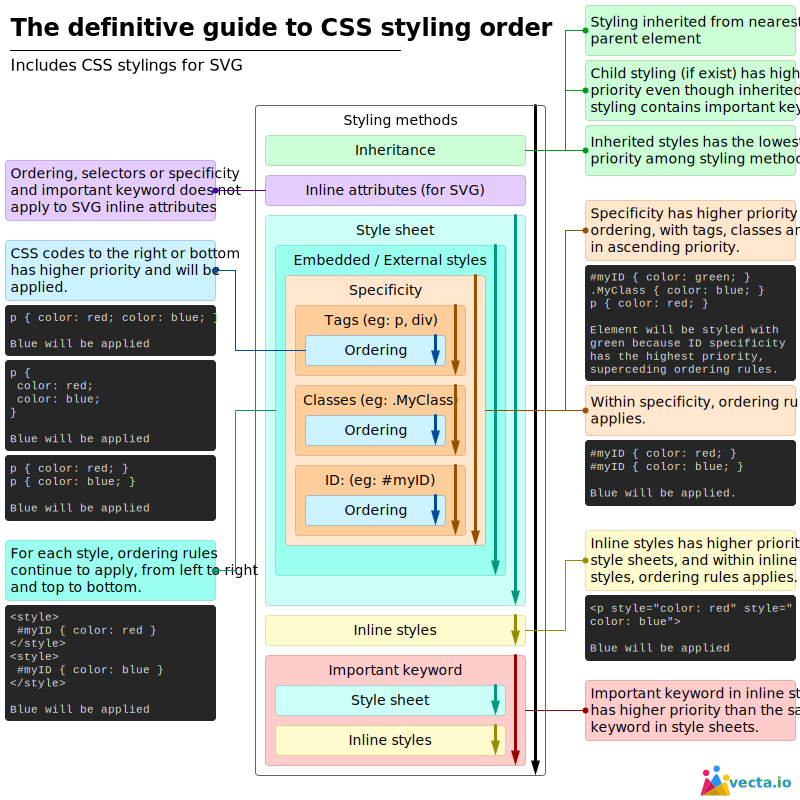

# jm-angularjs

## General

For compile scss run the following command:

    sass --watch books/scss/application.scss:books/application.css

## Staying dry
- D on't
- R epeat
- Y ourself

## CSS

## SASS

Run the following command:

    sass --watch sass:sass

Related links:

- [Extends vs mixins](https://medium.com/stories-from-the-keen/when-to-use-extends-vs-mixins-in-sass-b09d55abd53)
